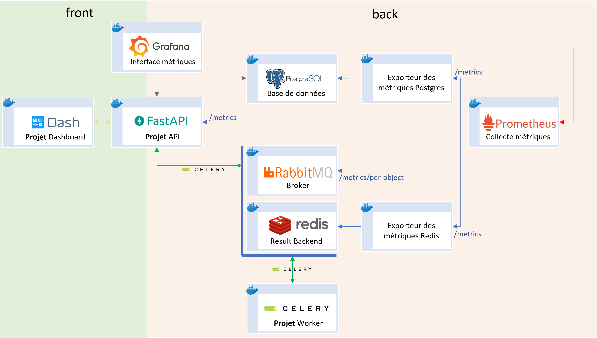

Description
============

Ce projet présente une stack complète composée d'une API REST (FastAPI) et d'un worker (Celery).
L'objectif de ce projet est didactique : monitoring, tests, métriques, documentation et bonnes pratiques sont disséminées partout.
Prenez le temps de regarder chaque fichier pour comprendre comment l'ensemble des services interagissent entre eux.

Voici un aperçu visuel du projet :

[](https://github.com/christophe-deleuze/full-stack-fastapi-celery)

La stack comprend :
 - Prometheus: Collecte de métriques ;
 - Grafana: Visualisation des métriques collectées par prometheus ;
 - cAdvisor: Monitoring des ressources machines ;
 - PostgreSQL: Base de données ;
 - postgres-exporter: Exporte des métriques de PostgreSQL vers Prometheus ;
 - pgAdmin: Administration de la base de données ;
 - RabbitMQ: Broker pour les tâches Celery (RabbitMQ met à disposition nativement ses métriques pour Prometheus ;
 - Redis: Result Backend utilisé pour stocker en mémoire les résultats de tâches Celery ;
 - redis-exporter: Exporte des métriques de Redis vers Prometheus ;
 - project-api (FastAPI): Framework utilisé pour construire une API REST entièrement asynchrone, l'export des métriques est assuré par l'api elle-même ;
 - project-worker (Celery): Gestionnaire de tâche asynchrone ;
 - Flower: Monitoring de base des workers et tâches celery, ainsi qu'export de métriques pour Prometheus.

Ils ne sont pas encore intégrés :
 - Elasticsearch: Moteur d'indexation et d'analyse de données ;
 - Kibana: Outil basé sur Elasticsearch et qui sera utilisé pour visualiser et analyser des logs.

Requirements
============

Vous avez besoin de [Docker](https://www.docker.com/products/docker-desktop) pour créer l'ensemble de l'environnement sur votre machine.
Une fois Docker exécuté, vérifier qu'il est bien lancé en mode Linux ! 

Quick Start
============

1. Lancer le projet :

```
git clone https://github.com/christophe-deleuze/full-stack-fastapi-celery.git
cd full-stack-fastapi-celery
docker-compose -p local-dev up -d
```

2. Jouer avec les urls :

- [API](http://127.0.0.1:5000/docs)
- [Flower - task monitoring](http://127.0.0.1:5555)
- [RabbitMQ - queues monitoring(guest/guest)](http://127.0.0.1:15672)
- [Prometheus - collect metrics](http://127.0.0.1:9090/)
- [PGAdmin - Postgresql Administration (postgres/postgres/postgres)](http://127.0.0.1:5050/)
- [cAdvisor - Ressources monitoring](http://127.0.0.1:8080/)
- [Grafana - Services monitoring](http://127.0.0.1:8080/)

Additionnal Informations
============

1. Stopper l'environnement :

```
docker-compose -p local-dev down
```


2. Nettoyer les volumes (Attention à ne pas supprimer les volumes de vos propres projets):

```
docker volume prune
```

3. Créer un environnement virtuel de travail avec [Anaconda](https://www.anaconda.com/products/individual):

```
conda create -n py310 python=3.10
conda activate py310
```

4. Charger l'environnement docker sans project-api & project-worker:

```
docker-compose -p local-dev down
docker-compose -p local-dev stop project-api
docker-compose -p local-dev stop project-worker
```

4. Créer un environnement virtuel pour l'api, installer ses dépendances et la charger:

```
conda create -n api310 python=3.10
conda activate api310
cd full-stack-fastapi-celery/project-api
pip install -r requirements
cd project-api

uvicorn api:app --host 0.0.0.0 --port 5000 --workers 1 --reload
```

Tips : --reload permet de recharger automatiquement l'API à chaque modification de son code.

5. Créer un environnement virtuel pour le worker, installer ses dépendances et le charger:

```
conda create -n worker310 python=3.10
conda activate worker310
cd full-stack-fastapi-celery/project-worker
pip install -r requirements
cd project-worker

# Si votre OS est windows 
set FORKED_BY_MULTIPROCESSING=1

celery -A tasks:app worker --pool prefork -Q project-worker --concurrency=1 -n worker@%h
```

Roadmap
============

- Valider le fonctionnement de l'ensemble de la solution
- Valider tous export de métriques : api / redis / rabbitMQ / PostgreSQL
- Valider la visualisation de métriques dans Grafana
- Implémenter des tâches celery : avec argument / sans argument / avec une serialisation pickle
- Implémenter 3 workflow celery : group / chain / group + chain
- Implémenter dans l'api les endpoints pour les tâches celery unitaires
- Implémenter dans l'api les endpoints pour les workflow celery
- Implémenter dans l'api une app qui fait du crud asynchrone avec PostgreSQL
- Implémenter les tests pour l'api
- Implémenter les tests pour le worker celery
- Finir la documentation fichier par fichier

Détails fichier par fichier du projet
============

## app.core.config.py

Fichier de configuration qui sert à gérer les variables d'environnements.

Au démarrage de l'application, la librairie Pydantic lit les variables d'environnements et remplace la valeur par défaut de chaque attribut de classe ayant le même nom qu'une variable d'environnement. 

Bonne pratique :
- Pas de donnée confidentielle dans les Settings ;
- Typer les variables ;
- Définir les hosts par défaut à 127.0.0.1 pour qu'ils accèdent nativement aux autres services chargés sur votre environnement de dev.

Ce que l'on y met :
- Nom de l'API
- Version de l'API
- Description de l'API
- Host
- User
- Password
- Broker
- Result Backend
- Timeout
- ...

## app.celery.async_celery.py

Celery est un framework de distribution de tâches asynchrones.
Il faut distinguer le producer qui génère des tâches et le worker qui traite des tâches.
Pour distribuer les tâches, Celery à besoin d'un broker et d'un result_backend.
Le broker est le messager qui enregistre les tâches.
Le result_backend est la base de données en mémoire qui stocke temporairement le résultat des tâches.
Le découplage broker / result_backend permet d'optimiser leurs travails respectifs.

Dans notre environnement :
- broker : RabbitMQ ;
- result_backend : Redis ;
- producer : FastAPI.

Celery n'est pas (encore) nativement compatible avec asyncio.
Par conséquent, pour tirer au maximum partie des capacités asynchrones de FastAPI il est nécessaire d'adapter Celery.
Seul les fonctionnalités qui servent à produire des tâches ont besoin d'être wrapper.

A noter que Celery permet de produire des tâches de deux façons.
- On connait la tâche : Il suffit de l'importer ;
- On ne connait pas la tâche : Il suffit de réecrire une signature.

Pour découpler l'API des dépendances des tâches, seul la seconde approche est à retenir.

Les fonctions à wrapper sont donc :
- Celery().send_task()
- AsyncResult.get()

AsyncResult.get() étant bloquant, son appel est précédé d'une vérification en boucle couplé à un temps d'attente de type 'exponential backoff' pour vérifier cycliquement si le résultat est prêt.

Pour transformer les fonctions synchrones en fonction asynchrones, j'utilise la librairie asgiref qui est nativement disponible avec FastAPI.

```
from asgiref.sync import sync_to_async
```

Tips :
- Par défaut la serialisation des tâches se fait au format json ;
- Dans un environnement sécurisé, il est possible d'ajouter la serialisation pickle à Celery afin de permettre de transiter n'importe quel objet python natif d'un service à un autre ;
```
app.conf.update(
    accept_content = ['application/json', 'application/x-python-serialize']
)
```
- Pour définir la serialisation à utiliser lors de l'envois d'une tâche on utilisera serializer='json' / serializer='pickle' : 
- Sécuriser les connections avec le broker (confirmer la publication des tâches) & le backend (garder la connection en vie) :
```
app.conf.update(
    broker_transport_options = {
        "confirm_publish": True,
        "max_retries": 5 },
    redis_socket_keepalive=True
)
```
- A chaque service autonome, sa propre file d'attente (queue). Le nom de la file d'attente sera le nom du type de service et le nom des tâches sera le nom des fonctions ;
- NB : Le nom des tâches pourrait être précédé du nom du service pour faciliter la lecture des logs ;

Bonne pratique :
- Définir explicitement une tâche avec son nom, sa serialisation et sa file d'attente ;
- Expirer automatiquement une requête avec un timeout et révoquer la tâche après timeout ;
- Executer des tâches de manières asynchrone en récupérant leur UUID qui pourrait être utilisé plus tard pour récupérer le résultat ;

## app.celery.schemas.py

Ce fichier sert à définir les schemas génériques à utiliser pour manipuler des tâches celery asynchrones.

- AsyncTask est le modèle de réponse utilisé pour retourner l'id d'une tâche 
- AsyncTaskStatus est le modèle de réponse utilisé pour retourner le status d'une tâche (id, status, result)

